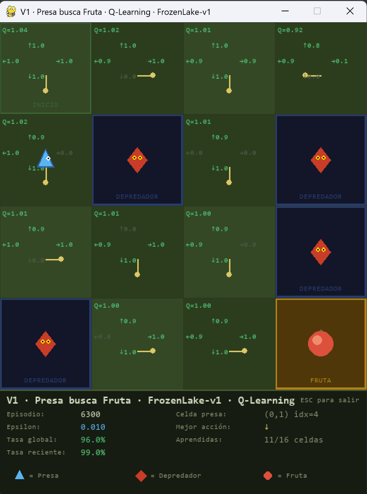

# Predator-Prey Simulation (V1)

AI coursework project. In this simulation a "prey" (the agent) has to learn how
to reach a "fruit" (the goal) while avoiding the "predators" (the holes) on a
grid. The agent learns on its own using **Q-Learning**, without anyone telling
it in advance which path is the correct one.

We are a group of three students and this is the work we have put together for
the practical assignment.

## Interface preview



The window shows the 4x4 grid with the Q-values and best-action arrows on each
cell, the prey (blue triangle) moving around, the predators (red diamonds) on
the hole cells and the fruit on the goal cell. At the bottom there is a HUD
with the current episode, epsilon, success rates and how many states have been
learned.

## What this project does

The setup is kept as simple as possible so the behavior of the algorithm is
easy to analyze. What we do is:

1. Use the `FrozenLake-v1` environment from Gymnasium **exactly as it comes
   from the library**, with no wrappers or modifications. The environment
   already provides the observations (integer state from 0 to 15), the actions
   (left, down, right, up) and the reward (+1 when reaching the goal, 0
   otherwise).
2. Train a Q-Table using classic Q-Learning (TD(0)).
3. Visualize both the training and a final demo with PyGame, reusing the
   project "skin" so that on screen it looks like a prey-and-fruit simulation
   instead of the original ice theme.

The map is 4x4, non-slippery (`is_slippery=False`), with the holes on cells
5, 7, 11 and 12, the start on cell 0 and the goal on cell 15.

## Why FrozenLake without wrappers

We did this on purpose. We wanted to see clearly what plain Q-Learning can
achieve on the standard environment, without any external help from custom
observations or custom reward functions. This way the baseline behavior is
well defined and easy to reason about.

## AI techniques used

Even though the base algorithm is Q-Learning, we added a couple of
improvements we studied in class that help the training converge much faster:

- **Epsilon-greedy policy** to balance exploration and exploitation.
- **Potential-based reward shaping** using the Manhattan distance to the
  fruit. This way the agent gets a dense signal during the episode and not
  only when it reaches the goal. The formula is
  `r_shaped = r + w * (gamma * Phi(s') - Phi(s))`, which keeps the optimal
  policy invariant (Ng et al., 1999).
- **Adaptive epsilon**: if the recent win rate passes a certain threshold, the
  epsilon decay is accelerated a bit so that the agent stops exploring
  earlier.

All of this lives in `qtable.py`.

## File structure

```
IA_v1-main/
├── config.py    # Constants and hyperparameters (alpha, gamma, epsilon, map...)
├── qtable.py    # QTable class with Q-Learning and reward shaping logic
├── trainer.py   # Trainer class: orchestrates training, evaluation and demo
├── renderer.py  # Renderer class with all the PyGame visual logic
└── main.py      # Entry point
```

We split it like this so that the learning logic and the graphical part are
kept separate and easier to maintain.

## Requirements

- Python 3.10 or higher
- `gymnasium`
- `pygame`
- `numpy`

Quick install:

```bash
pip install gymnasium pygame numpy
```

## How to run it

From the project folder:

```bash
python main.py
```

This runs:

1. The training (8000 episodes by default), showing a window with the Q-Table
   every 300 episodes.
2. A console print of the learned policy (best action per cell).
3. An evaluation with epsilon = 0 over 200 episodes to measure the real
   success rate.
4. A visual demo of 10 episodes always using the best action.

To change hyperparameters (number of episodes, alpha, gamma, etc.) there is no
need to touch the main code, only `config.py`.

## Main hyperparameters

The default values in `config.py` are the ones that worked best for us after
several tests:

| Parameter        | Value | Meaning                                  |
|------------------|-------|------------------------------------------|
| `ALPHA`          | 0.8   | Learning rate                            |
| `GAMMA`          | 0.95  | Discount factor                          |
| `EPSILON_START`  | 1.0   | Initial exploration                      |
| `EPSILON_END`    | 0.01  | Minimum exploration                      |
| `EPSILON_DECAY`  | 0.995 | Decay per episode                        |
| `EPISODES`       | 8000  | Training episodes                        |
| `SHAPING_WEIGHT` | 0.3   | Reward shaping weight                    |

## Expected results

With this configuration the agent should reach a success rate close to 100% in
the final evaluation. If it drops much below that, it is worth checking
whether the hyperparameters were modified or whether `is_slippery` has been
enabled by accident, since that makes the problem significantly harder.

## Authors

Group of three students working together on this AI assignment.
